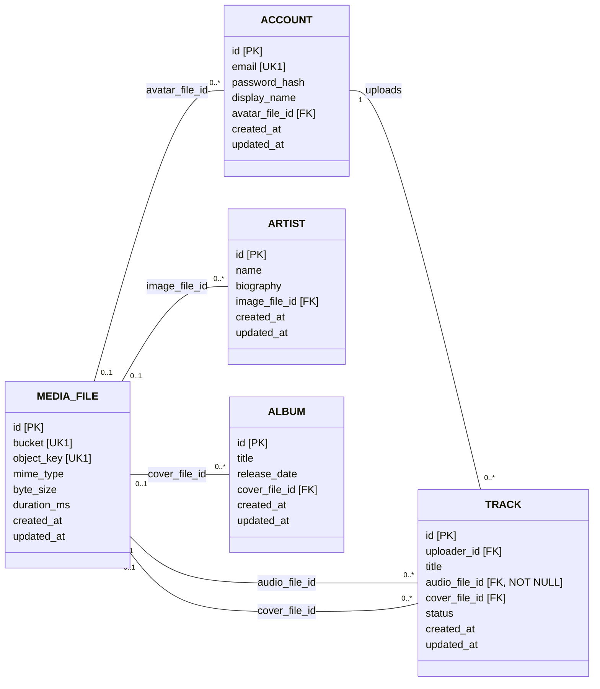
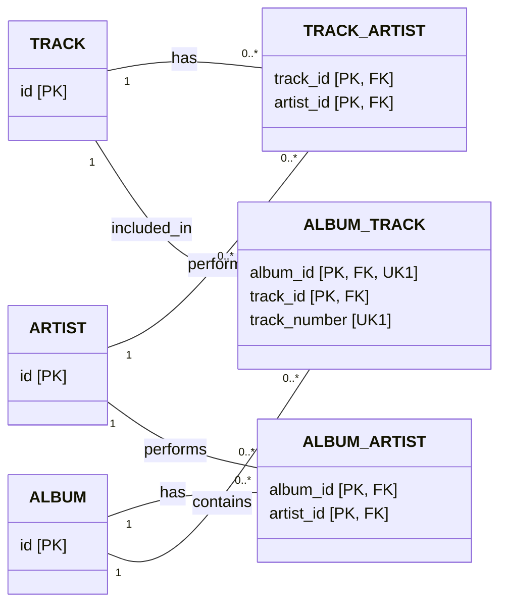
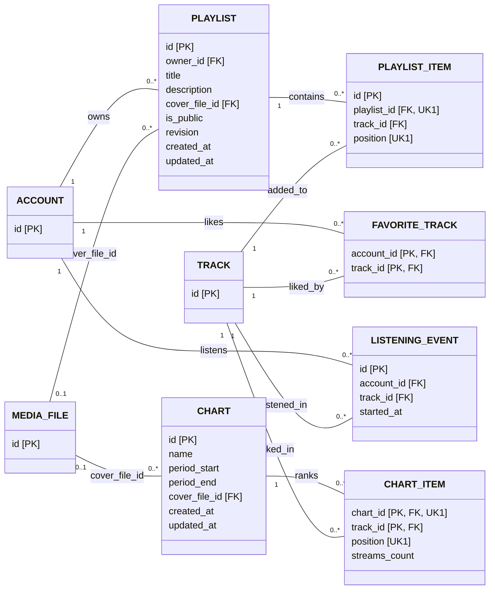
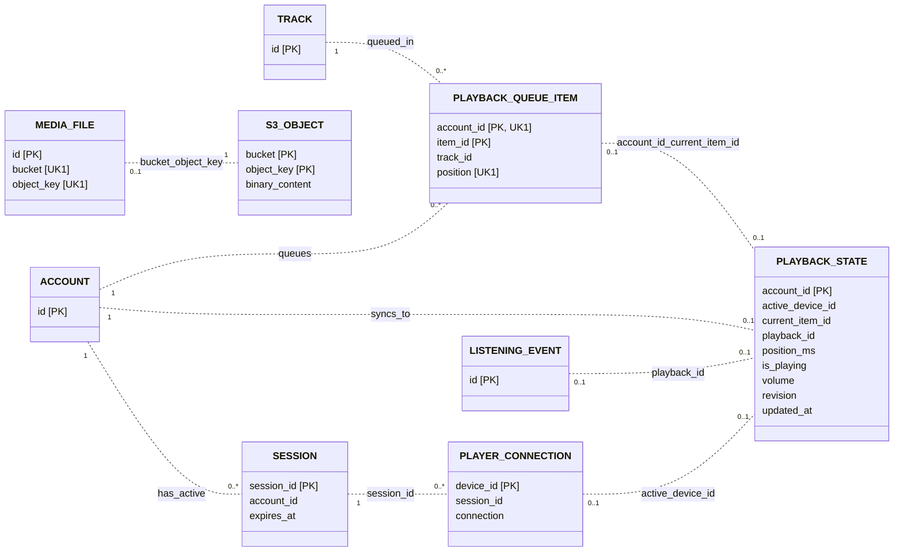

# ER Диаграммы модели данных

## 1. Основные сущности (PostgreSQL)

## 2. Исполнители и состав альбомов (PostgreSQL)

## 3. Плейлисты, чарты и история (PostgreSQL)

## 4. Redis, S3 и подключения плеера: логические связи с PostgreSQL

