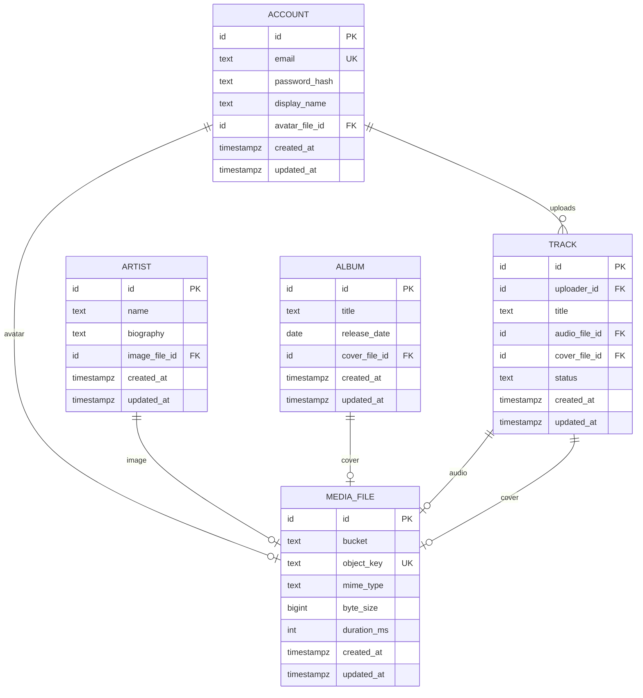
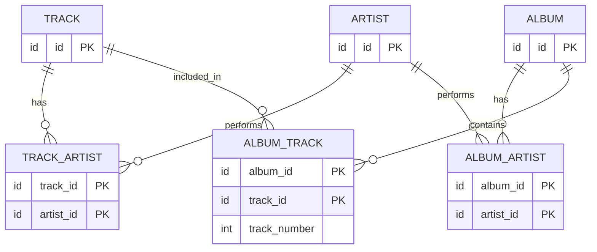
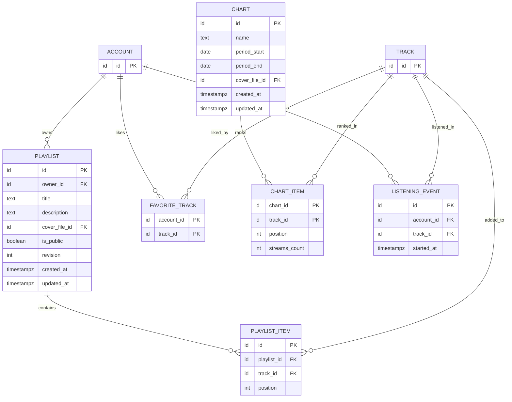
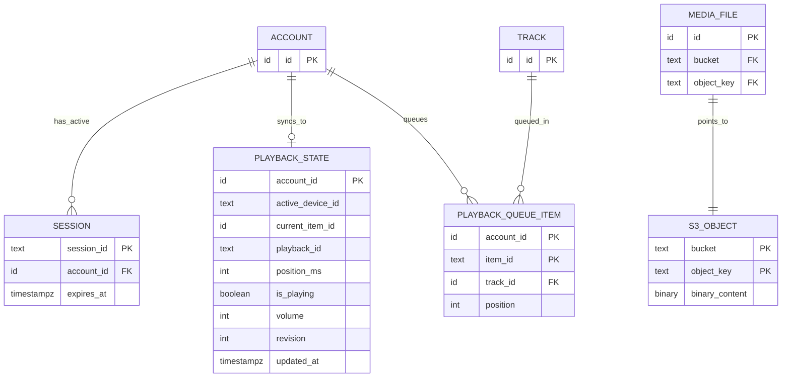

# ER Диаграммы модели данных

## 1. Основные сущности (PostgreSQL)

```mermaid
erDiagram
    ACCOUNT {
        id id PK
        text email UK
        text password_hash
        text display_name
        id avatar_file_id FK
        timestampz created_at
        timestampz updated_at
    }
    MEDIA_FILE {
        id id PK
        text bucket
        text object_key UK
        text mime_type
        bigint byte_size
        int duration_ms
        timestampz created_at
        timestampz updated_at
    }
    ARTIST {
        id id PK
        text name
        text biography
        id image_file_id FK
        timestampz created_at
        timestampz updated_at
    }
    ALBUM {
        id id PK
        text title
        date release_date
        id cover_file_id FK
        timestampz created_at
        timestampz updated_at
    }
    TRACK {
        id id PK
        id uploader_id FK
        text title
        id audio_file_id FK
        id cover_file_id FK
        text status
        timestampz created_at
        timestampz updated_at
    }

    ACCOUNT ||--o{ TRACK : "uploads"
    ACCOUNT ||--o| MEDIA_FILE : "avatar"
    ARTIST ||--o| MEDIA_FILE : "image"
    ALBUM ||--o| MEDIA_FILE : "cover"
    TRACK ||--o| MEDIA_FILE : "audio"
    TRACK ||--o| MEDIA_FILE : "cover"
```

```mermaid
erDiagram
    TRACK {
        id id PK
    }
    ARTIST {
        id id PK
    }
    ALBUM {
        id id PK
    }
    TRACK_ARTIST {
        id track_id PK
        id artist_id PK
    }
    ALBUM_ARTIST {
        id album_id PK
        id artist_id PK
    }
    ALBUM_TRACK {
        id album_id PK
        id track_id PK
        int track_number
    }

    TRACK ||--o{ TRACK_ARTIST : "has"
    ARTIST ||--o{ TRACK_ARTIST : "performs"
    ALBUM ||--o{ ALBUM_ARTIST : "has"
    ARTIST ||--o{ ALBUM_ARTIST : "performs"
    ALBUM ||--o{ ALBUM_TRACK : "contains"
    TRACK ||--o{ ALBUM_TRACK : "included_in"
```

```mermaid
erDiagram
    ACCOUNT {
        id id PK
    }
    TRACK {
        id id PK
    }
    PLAYLIST {
        id id PK
        id owner_id FK
        text title
        text description
        id cover_file_id FK
        boolean is_public
        int revision
        timestampz created_at
        timestampz updated_at
    }
    PLAYLIST_ITEM {
        id id PK
        id playlist_id FK
        id track_id FK
        int position
    }
    FAVORITE_TRACK {
        id account_id PK
        id track_id PK
    }
    CHART {
        id id PK
        text name
        date period_start
        date period_end
        id cover_file_id FK
        timestampz created_at
        timestampz updated_at
    }
    CHART_ITEM {
        id chart_id PK
        id track_id PK
        int position
        int streams_count
    }
    LISTENING_EVENT {
        id id PK
        id account_id FK
        id track_id FK
        timestampz started_at
    }

    ACCOUNT ||--o{ PLAYLIST : "owns"
    PLAYLIST ||--o{ PLAYLIST_ITEM : "contains"
    TRACK ||--o{ PLAYLIST_ITEM : "added_to"
    ACCOUNT ||--o{ FAVORITE_TRACK : "likes"
    TRACK ||--o{ FAVORITE_TRACK : "liked_by"
    CHART ||--o{ CHART_ITEM : "ranks"
    TRACK ||--o{ CHART_ITEM : "ranked_in"
    ACCOUNT ||--o{ LISTENING_EVENT : "listens"
    TRACK ||--o{ LISTENING_EVENT : "listened_in"
```

```mermaid
erDiagram
    ACCOUNT {
        id id PK
    }
    TRACK {
        id id PK
    }
    MEDIA_FILE {
        id id PK
        text bucket FK
        text object_key FK
    }
    SESSION {
        text session_id PK
        id account_id FK
        timestampz expires_at
    }
    PLAYBACK_STATE {
        id account_id PK
        text active_device_id
        id current_item_id
        text playback_id
        int position_ms
        boolean is_playing
        int volume
        int revision
        timestampz updated_at
    }
    PLAYBACK_QUEUE_ITEM {
        id account_id PK
        text item_id PK
        id track_id FK
        int position
    }
    S3_OBJECT {
        text bucket PK
        text object_key PK
        binary binary_content
    }

    ACCOUNT ||--o{ SESSION : "has_active"
    ACCOUNT ||--o| PLAYBACK_STATE : "syncs_to"
    ACCOUNT ||--o{ PLAYBACK_QUEUE_ITEM : "queues"
    TRACK ||--o{ PLAYBACK_QUEUE_ITEM : "queued_in"
    MEDIA_FILE ||--|| S3_OBJECT : "points_to"
```